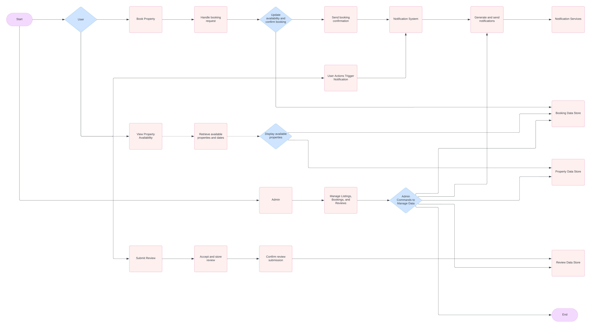
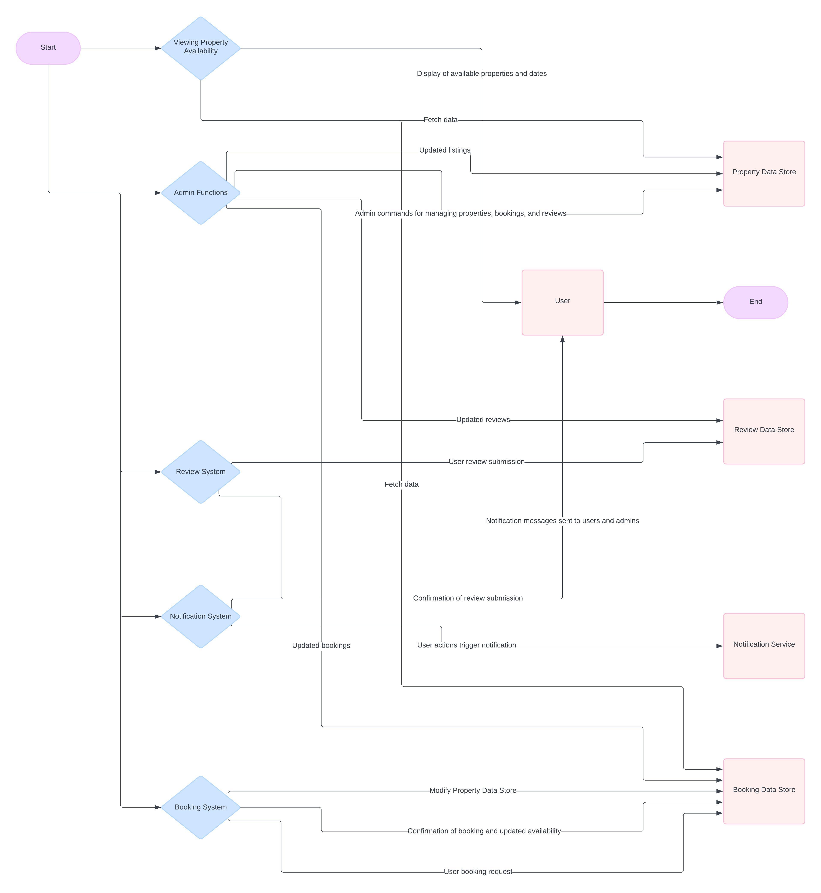
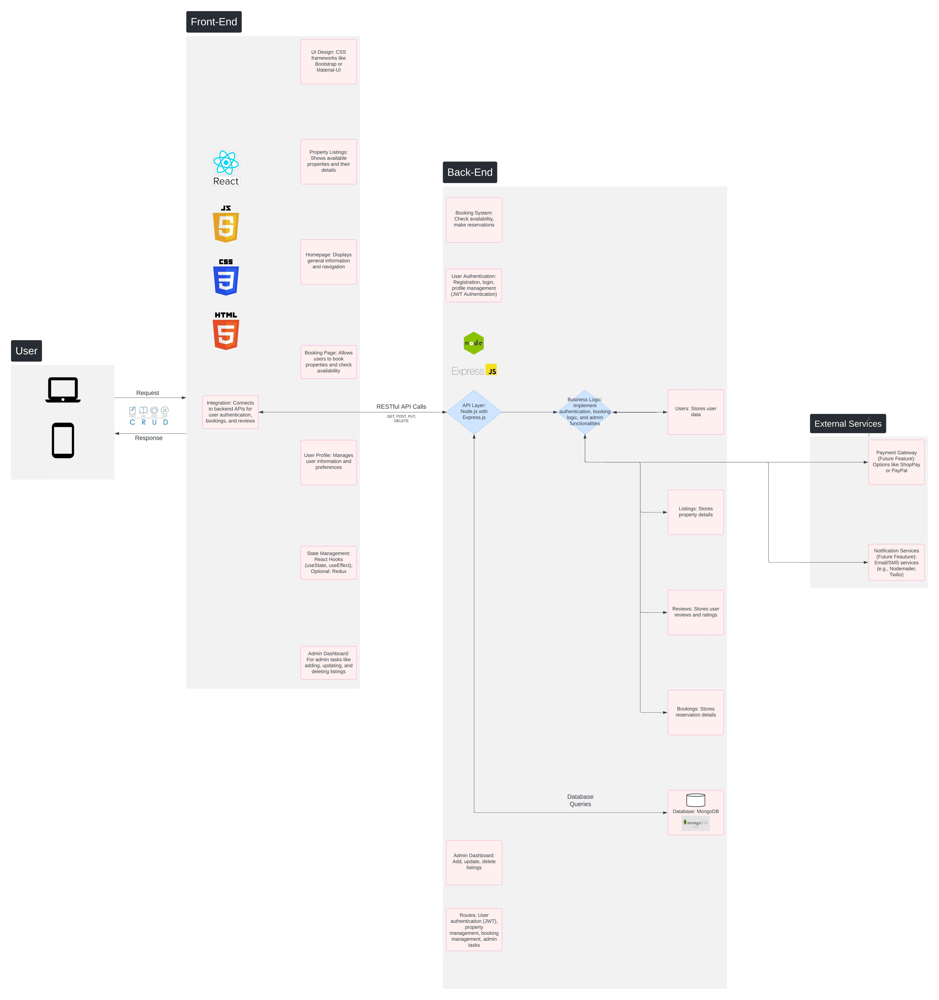

# T3A2-A: Full Stack App (Part A)

## R1. Project Overview

### Purpose

The Yallambee Tiny Homes Accommodation Booking App is designed to provide a seamless platform for users to browse and book stays in a unique tiny home. While Yallambee is currently available through Airbnb, this app will offer greater control over bookings, allowing the client to provide a more personalised and direct experience for their guests. The app empowers guests to explore the Yallambee property, check availability, make bookings, and manage their reservations effortlessly, all in one place.

For admin users, the platform offers robust tools to manage property listings, oversee bookings, and maintain user profiles, ensuring that the operations of Yallambee Tiny Homes are handled smoothly and efficiently. By transitioning to their own booking system, the client aims to enhance the guest experience and streamline their business operations, providing a tailored service that aligns with the unique and tranquil nature of Yallambee.

### Functionality / Features

#### MVP

- **User Authentication**: Users can register, log in, and manage their profiles.
- **Property Listing/s**: Users can view available properties (one, initially), including details such as price, location, and amenities.
- **Booking System**: Users can make a reservation by selecting available dates and processing payments (payments are a stretch goal).
- **Admin Dashboard**: Admins can add, update, and delete property listings, manage bookings, and oversee user accounts.

#### Stretch

- **Payment Integration**: Users can securely process payments for their reservations through a third-party payment gateway.
- **User Reviews and Ratings**: Users can leave reviews and rate their stay after completing a booking. Admins will have the ability to moderate reviews to ensure appropriate content is displayed.
- **Notifications**: Users will receive email or SMS notifications for booking confirmations, payment receipts, and reminders. Admins will also receive notifications for new bookings and cancellations, ensuring they are always up-to-date with the latest activities on the platform.

### Target Audience

The target audience for Yallambee Tiny Homes primarily includes young, professional couples from Sydney and Canberra who are seeking a unique and tranquil getaway. These travelers are looking for a chance to disconnect from their busy lives and enjoy a peaceful stay in a beautiful, off-grid tiny home. Additionally, the app is designed to cater to the owners of Yallambee, who wish to efficiently manage bookings, listings, and guest interactions through a more controlled and personalised platform.

### Tech Stack

- **Frontend**: React.js, Tailwind CSS
- **Backend**: Node.js, Express.js
- **Database**: MongoDB
- **Authentication**: Passport.js, JWT
- **Payment Processing**: Stripe API
- **Notifications**: Nodemailer (Email), Twilio (SMS)

---

## R2: Dataflow Diagram

The Dataflow Diagram represents the flow of data within the Tiny Home Accommodation Booking App. It includes the processes that interact with data inputs and outputs, as well as data storage.

## 0 DFD (Context Diagram)

### Purpose

The 0 DFD provides a high-level overview of the system, showing the interactions between external entities and the web application.

### External Entities

1. **User**
   - **Interactions:**
     - Views property availability
     - Makes bookings
     - Submits reviews
     - Receives notifications

2. **Admin**
   - **Interactions:**
     - Manages property listings
     - Manages bookings
     - Manages reviews

### System

- **Web Application**
  - Handles user requests and admin functions.

### Data Flows

1. **User to Web Application:**
   - **Input Flows:**
     - Request for property availability
     - Booking requests
     - Review submissions
     - Authentication requests (registration, login)
   - **Output Flows:**
     - Display of available properties and dates
     - Booking confirmation
     - Review confirmation
     - User profile data

2. **Admin to Web Application:**
   - **Input Flows:**
     - Commands for managing properties, bookings, and reviews
   - **Output Flows:**
     - Updated listings, bookings, and reviews

## 1 DFD (Level 1 DFD)

### Purpose

The 1 DFD provides a detailed view of the main processes within the system and their interactions with data stores and external entities.

### Processes

1. **1.1 Viewing Property Availability**
2. **1.2 Booking System**
3. **1.3 Review System**
4. **1.4 Notification System**
5. **1.5 Admin Functions**

### Data Stores

1. **D1: Property Data Store**
   - Stores property details (descriptions, images, availability).

2. **D2: Booking Data Store**
   - Stores booking information (dates, user details).

3. **D3: Review Data Store**
   - Stores user reviews and ratings.

4. **D4: User Data Store**
   - Stores user profiles and authentication details.

### Data Flows

1. **Viewing Property Availability (Process 1.1):**
   - **Input Flows:**
     - User request for property availability
   - **Output Flows:**
     - Display of available properties and dates
   - **Data Interactions:**
     - Fetch data from **Property Data Store** and **Booking Data Store**

2. **Booking System (Process 1.2):**
   - **Input Flows:**
     - User booking request
   - **Output Flows:**
     - Confirmation of booking and updated availability
   - **Data Interactions:**
     - Update **Booking Data Store**
     - Potentially modify **Property Data Store**

3. **Review System (Process 1.3):**
   - **Input Flows:**
     - User review submission
   - **Output Flows:**
     - Confirmation of review submission
   - **Data Interactions:**
     - Save reviews in **Review Data Store**

4. **Notification System (Process 1.4):**
   - **Input Flows:**
     - Triggers based on user actions (e.g., booking confirmation)
   - **Output Flows:**
     - Notification messages sent to users and admins
   - **Data Interactions:**
     - Use notification services for sending messages

5. **Admin Functions (Process 1.5):**
   - **Input Flows:**
     - Admin commands for managing properties, bookings, and reviews
   - **Output Flows:**
     - Updated listings, bookings, and reviews
   - **Data Interactions:**
     - Modify data in **Property Data Store**, **Booking Data Store**, and **Review Data Store**

### Diagram Overview

- **Processes:**
  - **1.1:** Retrieves and displays available properties.
  - **1.2:** Manages booking requests and updates availability.
  - **1.3:** Handles user review submissions.
  - **1.4:** Sends notifications based on user actions.
  - **1.5:** Manages property listings, bookings, and reviews.

- **Data Stores:**
  - **D1:** Contains property details.
  - **D2:** Contains booking information.
  - **D3:** Contains user reviews and ratings.
  - **D4:** Contains user profiles and authentication data.

- **External Entities:**
  - **User:** Interacts with the processes to view properties, make bookings, and leave reviews.
  - **Admin:** Interacts with processes for managing properties, bookings, and reviews.
  
---

## R3: Application Architecture Diagram

The Application Architecture Diagram outlines the high-level structure of the app, including the frontend, backend, database, and external services.

### Diagram

## Overview

Application Architecture Diagram outlines the high-level structure of Full Stack web application. It illustrates the major components, their interactions, and the technologies used. This application uses the MERN stack, including MongoDB, Express.js, ReactJS, and Node.js.

## Components

### Front-End: ReactJS

- **Components:**
  - **Homepage:** General information and navigation.
  - **Property Listings:** Display of available properties and details.
  - **Booking Page:** View availability and make reservations.
  - **User Profile:** Manage user information and preferences.
  - **Admin Dashboard:** Manage properties, bookings, and reviews.

- **State Management:**
  - **React Hooks:** `useState`, `useEffect`.
  - **Optional:** Redux for complex state management.

- **UI Design:**
  - **CSS:** 

- **Integration:**
  - Connects to backend APIs for authentication, bookings, and reviews.

### Back-End: Node.js with Express.js

- **API Layer:**
  - **Routes:**
    - **User Authentication:** Registration, login, profile management using JWT.
    - **Property Management:** Adding, updating, and deleting property listings.
    - **Booking Management:** Checking availability and making reservations.
    - **Admin Dashboard:** Managing and updating listings, bookings, and reviews.

- **Business Logic:**
  - Handles authentication, booking logic, and administrative tasks.

### Database: MongoDB

- **Collections:**
  - **Users:** User profiles and authentication details.
  - **Listings:** Property information (descriptions, images, availability).
  - **Bookings:** Reservation details (user information, dates).
  - **Reviews:** User reviews and ratings.

### External Services

- **Payment Gateway (Future Feature):**
  - **Options:** ShopPay, PayPal.

- **Notification Services (Future Feature):**
  - **Options:**
    - **Email:** Nodemailer.
    - **SMS:** Twilio.

## Diagram Overview

- **Front-End:**
  - ReactJS components interact with the backend API layer for user actions.

- **Back-End:**
  - The Express.js API layer processes requests, handles business logic, and communicates with MongoDB.

- **Database:**
  - MongoDB stores and retrieves data as needed.

- **External Services:**
  - Integrates with the backend for payment processing and notifications.

## Supporting Documentation

### Technical Specifications

- **ReactJS:** Front-end library for building UIs.
- **Node.js:** JavaScript runtime for server-side code.
- **Express.js:** Web framework for RESTful APIs.
- **MongoDB:** NoSQL database for data storage.
- **JWT:** JSON Web Token for secure authentication.
- **Payment Gateways:** ShopPay, PayPal (for future integration).
- **Notification Services:** Nodemailer, Twilio (for future integration of email and SMS).

### Implementation Notes

- Follow security best practices for authentication and data handling.
- Optimise state management and API interactions for performance.
- Plan for scalability in both database design and application architecture.

### Integration Points

- **Front-End:** Makes API calls to the Express.js backend for data operations.
- **Back-End:** Manages business logic and interacts with MongoDB.
- **External Services:** Handles payments and notifications integrated into the backend.

---

## R4: User Stories

### 1. User Authentication

- **User Story 1**: As a user, I want to register an account so that I can log in and access personalised features.
  - **Acceptance Criteria**:
    - User can register with an email and password.
    - User receives a confirmation email after registration.
    - Passwords are securely hashed and stored.
  - **Checklist**:
    - [ ] Design registration form UI.
    - [ ] Implement backend logic for user registration.
    - [ ] Set up email confirmation process.
    - [ ] Implement password hashing and storage.
    - [ ] Test registration flow end-to-end.

- **User Story 2**: As a user, I want to log in to my account so that I can access my profile and booking history.
  - **Acceptance Criteria**:
    - User can log in with their registered email and password.
    - User receives a JWT token upon successful login.
    - Invalid login attempts are handled with appropriate error messages.
  - **Checklist**:
    - [ ] Design login form UI.
    - [ ] Implement backend logic for user authentication.
    - [ ] Set up JWT token generation and storage.
    - [ ] Handle error messages for invalid login attempts.
    - [ ] Test login flow with valid and invalid credentials.

- **User Story 3**: As a user, I want to reset my password so that I can regain access to my account if I forget my password.
  - **Acceptance Criteria**:
    - User can request a password reset by providing their email.
    - User receives an email with a password reset link.
    - User can reset the password using the provided link.
  - **Checklist**:
    - [ ] Design password reset request UI.
    - [ ] Implement backend logic for password reset requests.
    - [ ] Set up email with reset link functionality.
    - [ ] Implement password reset form and logic.
    - [ ] Test password reset process from request to completion.

### 2. Property Listing/s

- **User Story 4**: As a user, I want to browse available properties (single listing initially) so that I can choose the best one for my stay.
  - **Acceptance Criteria**:
    - User can view a list of properties with thumbnails, names, locations, and prices.
    - User can filter properties by location, price range, and amenities.
    - Property availability is clearly indicated.
  - **Checklist**:
    - [ ] Design property listing page UI.
    - [ ] Implement backend API to retrieve properties.
    - [ ] Develop frontend to display properties with filtering options.
    - [ ] Display property availability status.
    - [ ] Test property listing and filtering functionality.

- **User Story 5**: As a user, I want to view detailed information about a property so that I can decide if it meets my needs.
  - **Acceptance Criteria**:
    - User can view detailed property descriptions, images, amenities, and reviews.
    - User can see the price per night and availability for selected dates.
  - **Checklist**:
    - [ ] Design property detail page UI.
    - [ ] Implement backend API to retrieve property details.
    - [ ] Display property images, descriptions, amenities, and reviews.
    - [ ] Show price per night and availability for selected dates.
    - [ ] Test the property detail page for accurate data display.

### 3. Booking System

- **User Story 6**: As a user, I want to check the availability of a property for my selected dates so that I can book it if it’s available.
  - **Acceptance Criteria**:
    - User can select check-in and check-out dates using a date picker.
    - The system checks the availability of the property for the selected dates.
    - User receives immediate feedback on availability.
  - **Checklist**:
    - [ ] Design booking date selection UI.
    - [ ] Implement date picker functionality.
    - [ ] Develop backend API to check property availability.
    - [ ] Display availability status based on selected dates.
    - [ ] Test availability check process with different date ranges.

- **User Story 7**: As a user, I want to book a property so that I can secure my stay for the selected dates.
  - **Acceptance Criteria**:
    - User can fill out a booking form with personal details and preferences.
    - User sees a summary of their booking before confirming.
    - Booking confirmation is provided after successful payment.
  - **Checklist**:
    - [ ] Design booking form UI.
    - [ ] Implement backend logic for booking creation.
    - [ ] Display booking summary before confirmation.
    - [ ] Integrate payment gateway for booking confirmation.
    - [ ] Test end-to-end booking process.

- **User Story 8**: As a user, I want to receive a confirmation of my booking via email so that I have a record of my reservation.
  - **Acceptance Criteria**:
    - User receives an email with booking details, including dates, property name, and total cost.
    - Email contains instructions for check-in and contact information.
  - **Checklist**:
    - [ ] Set up email notification service.
    - [ ] Create email templates for booking confirmation.
    - [ ] Implement backend logic to trigger email on booking confirmation.
    - [ ] Ensure booking details are accurately reflected in the email.
    - [ ] Test email notification for different booking scenarios.

- **User Story 9**: As an admin, I want to view and manage all bookings so that I can keep track of reservations and availability.
  - **Acceptance Criteria**:
    - Admin can view a list of all bookings with details such as dates, user information, and status.
    - Admin can modify or cancel bookings if necessary.
    - Booking statuses (e.g., confirmed, pending, cancelled) are clearly indicated.
  - **Checklist**:
    - [ ] Design admin booking management UI.
    - [ ] Implement backend API to retrieve and manage bookings.
    - [ ] Enable admin to modify or cancel bookings.
    - [ ] Display booking statuses and details clearly.
    - [ ] Test admin booking management functionality.

### 4. Payment Integration

- **User Story 10**: As a user, I want to securely pay for my booking using my credit card so that I can confirm my reservation.
  - **Acceptance Criteria**:
    - User can enter credit card information securely.
    - Payment is processed through a third-party service like Stripe.
    - User receives a payment confirmation upon successful transaction.
  - **Checklist**:
    - [ ] Design payment form UI.
    - [ ] Integrate Stripe (or other payment gateway) for payment processing.
    - [ ] Implement secure handling of payment data.
    - [ ] Generate and display payment confirmation.
    - [ ] Test payment process from start to finish.

- **User Story 11**: As an admin, I want to view payment transactions so that I can track revenue and manage financial records.
  - **Acceptance Criteria**:
    - Admin can view a list of all payment transactions, including amounts, dates, and booking IDs.
    - Admin can issue refunds if necessary.
  - **Checklist**:
    - [ ] Design admin payment management UI.
    - [ ] Implement backend API to retrieve payment transactions.
    - [ ] Enable admin to view transaction details and issue refunds.
    - [ ] Test payment transaction tracking and refund process.

### 5. User Profile Management

- **User Story 12**: As a user, I want to view and edit my profile information so that my details are up to date.
  - **Acceptance Criteria**:
    - User can view their profile information, including name, email, and booking history.
    - User can update their personal details and save changes.
    - Profile updates are reflected immediately.
  - **Checklist**:
    - [ ] Design user profile page UI.
    - [ ] Implement backend API to retrieve and update user profile.
    - [ ] Develop frontend logic to handle profile updates.
    - [ ] Ensure real-time update of profile information.
    - [ ] Test profile management functionality for accuracy.

- **User Story 13**: As a user, I want to view my booking history so that I can keep track of my past and upcoming stays.
  - **Acceptance Criteria**:
    - User can view a list of past and upcoming bookings with details such as dates, property names, and statuses.
    - User can click on a booking to view more details or make changes.
  - **Checklist**:
    - [ ] Design booking history UI.
    - [ ] Implement backend API to retrieve booking history.
    - [ ] Display past and upcoming bookings clearly.
    - [ ] Enable interaction with booking details for further actions.
    - [ ] Test booking history display and functionality.

### 6. Admin Dashboard

- **User Story 14**: As an admin, I want to add, update, and delete property listings so that I can manage the available accommodations.
  - **Acceptance Criteria**:
    - Admin can create new property listings with details such as name, description, location, and price.
    - Admin can update existing property details.
    - Admin can delete property listings that are no longer available.
  - **Checklist**:
    - [ ] Design admin property management UI.
    - [ ] Implement backend API for CRUD operations on properties.
    - [ ] Enable admin to add, update, and delete properties.
    - [ ] Ensure real-time updates to property listings.
    - [ ] Test property management functionality for accuracy.

- **User Story 15**: As an admin, I want to manage user accounts so that I can handle customer inquiries and issues.
  - **Acceptance Criteria**:
    - Admin can view a list of all users with their profiles and booking history.
    - Admin can update user roles (e.g., upgrade a user to an admin).
    - Admin can deactivate or delete user accounts if necessary.
  - **Checklist**:
    - [ ] Design admin user management UI.
    - [ ] Implement backend API to retrieve and manage user accounts.
    - [ ] Enable admin to update user roles and deactivate accounts.
    - [ ] Ensure safe handling of user data during updates.
    - [ ] Test user management functionality for completeness.

### 7. User Reviews and Ratings

- **User Story 16**: As a user, I want to leave a review and rate my stay so that I can share my experience with others.
  - **Acceptance Criteria**:
    - User can submit a review and rating after their stay.
    - Review is displayed on the property listing page after admin approval.
    - User can edit or delete their review if needed.
  - **Checklist**:
    - [ ] Design review submission UI.
    - [ ] Implement backend API to handle reviews and ratings.
    - [ ] Develop frontend logic for displaying reviews.
    - [ ] Enable admin review moderation.
    - [ ] Test review submission, moderation, and display functionality.

- **User Story 17**: As an admin, I want to moderate reviews so that only appropriate content is displayed on the site.
  - **Acceptance Criteria**:
    - Admin can review and approve or reject user reviews.
    - Admin can edit or delete reviews that violate guidelines.
  - **Checklist**:
    - [ ] Design admin review moderation UI.
    - [ ] Implement backend logic for review approval and rejection.
    - [ ] Enable admin to edit or delete reviews as necessary.
    - [ ] Test moderation process to ensure proper functionality.

### 8. Notifications

- **User Story 18**: As a user, I want to receive notifications about my bookings and payment status so that I am always informed.
  - **Acceptance Criteria**:
    - User receives email notifications for booking confirmations, cancellations, and payment receipts.
    - User can opt-in for SMS notifications for reminders or urgent updates.
  - **Checklist**:
    - [ ] Set up email and SMS notification services.
    - [ ] Implement backend logic to trigger notifications.
    - [ ] Create notification templates for different scenarios.
    - [ ] Enable user preference settings for notifications.
    - [ ] Test notifications for accuracy and timeliness.

- **User Story 19**: As an admin, I want to be notified of new bookings and cancellations so that I can manage the properties effectively.
  - **Acceptance Criteria**:
    - Admin receives notifications for new bookings, cancellations, and user inquiries.
    - Notifications include relevant details such as booking ID, user information, and dates.
  - **Checklist**:
    - [ ] Set up admin notification system.
    - [ ] Implement backend logic for triggering admin notifications.
    - [ ] Ensure notifications contain all necessary information.
    - [ ] Test admin notifications for various scenarios.

## 9. Search and Filter

- **User Story 20**: As a user, I want to search for properties based on specific criteria so that I can find accommodation that suits my needs.
  - **Acceptance Criteria**:
    - User can enter search criteria such as location, price range, and amenities.
    - Search results are filtered based on the entered criteria.
    - User can sort results by price, availability, or rating.
  - **Checklist**:
    - [ ] Design search and filter UI.
    - [ ] Implement backend API to support search and filtering.
    - [ ] Develop frontend logic for dynamic search and filtering.
    - [ ] Enable sorting of results by various criteria.
    - [ ] Test search and filter functionality for accuracy.

---

## R5: Wireframes

Wireframes provide a visual representation of the app's layout for various screen sizes. These wireframes guide the design and development of the user interface.

### Wireframes

- **Homepage**
  
- **Property Listing Page**
  
- **Booking Page**
  
- **User Profile Page**
  
- **Admin Dashboard**
  

*Include explanations of the design decisions, user flow, and how the wireframes meet the project requirements.*

---

## R6: Project Management

### Trello Board

We are using Trello to manage our project tasks, track progress, and collaborate as a team. The board is organised into columns such as "Backlog", "Design", "To Do", "Doing", and "Done" to reflect the current status of each task.

Our Kanban Board can be seen [here](https://trello.com/invite/b/66b2f86152f9d00b5467bbb8/ATTIe1afc6a791759e8fd5f9411c76de9561A7CDF884/full-stack-project).

### Screenshots

- **Initial Setup**
  
  
- **Mid-Project Progress**
  
- **Final Task Completion**
  

*Include a brief explanation of how the Trello board was used to manage the project timeline and task assignments.*

### Project Timeline

As a team, we created a prospective [timeline](project_management/project_timeline.md) to help us stay on track with our tasks and better manage the project.

### Ways of Working

We developed a Ways of Working document to enhance communication, collaboration, and efficiency within our team. We wanted to establish that everyone is aligned and working towards the same goals, with clear processes in place to support successful project completion. Please see [here](project_management/WaysOfWorking.md).

### GitHub Workflow

We have outlined our GitHub workflow and branching stategy [here](.github/step-by-step-github-workflow.md).

### Client Feedback

We collated feedback and ideas from our client [here](project_management/client_feedback.md). This document will be used throughout the project and iterated with client feedback as the project progresses.

### API Specifications

Our draft API specs can be found [here](project_management/API_specs.md).

---

## Appendix

### References

- **Technology Documentation**: Links to documentation for React.js, Node.js, MongoDB, etc.
- **Design Tools**: Figma
- **Project Management**: Trello

### Contributors

- **Shay Zimmerle**
- **Jemma Larosa**
- **Jonathan Ow**
