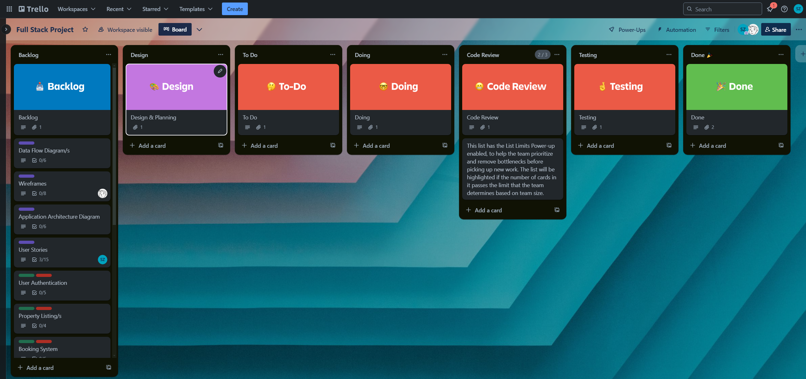

# T3A2-A: Full Stack App (Part A)

## R1. Project Overview

### Purpose

The Tiny Home Accommodation Booking App is designed to provide a seamless platform for users to browse and book stays at tiny homes. The app allows users to explore available properties, check availability, make bookings, and manage their reservations. Admin users can manage property listings, bookings, and user profiles.

### Functionality / Features

- **User Authentication**: Users can register, log in, and manage their profiles.
- **Property Listings**: Users can view available properties, including details such as price, location, and amenities.
- **Booking System**: Users can book properties by selecting available dates and processing payments.
- **Admin Dashboard**: Admins can add, update, and delete property listings, manage bookings, and oversee user accounts.

### Target Audience

The target audience includes travelers looking for unique accommodation experiences, particularly those interested in tiny homes. The app is also targeted at property owners who want to manage bookings and listings efficiently.

### Tech Stack

- **Frontend**: React.js, Tailwind CSS
- **Backend**: Node.js, Express.js
- **Database**: MongoDB
- **Authentication**: Passport.js, JWT
- **Payment Processing**: Stripe API
- **Notifications**: Nodemailer (Email), Twilio (SMS)

---

## R2: Dataflow Diagram

The Dataflow Diagram represents the flow of data within the Tiny Home Accommodation Booking App. It includes the processes that interact with data inputs and outputs, as well as data storage.

## 0 DFD (Context Diagram)

### Purpose

The 0 DFD provides a high-level overview of the system, showing the interactions between external entities and the web application.

### External Entities

1. **User**
   - **Interactions:**
     - Views property availability
     - Makes bookings
     - Submits reviews
     - Receives notifications

2. **Admin**
   - **Interactions:**
     - Manages property listings
     - Manages bookings
     - Manages reviews

### System

- **Web Application**
  - Handles user requests and admin functions.

### Data Flows

1. **User to Web Application:**
   - **Input Flows:**
     - Request for property availability
     - Booking requests
     - Review submissions
     - Authentication requests (registration, login)
   - **Output Flows:**
     - Display of available properties and dates
     - Booking confirmation
     - Review confirmation
     - User profile data

2. **Admin to Web Application:**
   - **Input Flows:**
     - Commands for managing properties, bookings, and reviews
   - **Output Flows:**
     - Updated listings, bookings, and reviews

## 1 DFD (Level 1 DFD)

### Purpose

The 1 DFD provides a detailed view of the main processes within the system and their interactions with data stores and external entities.

### Processes

1. **1.1 Viewing Property Availability**
2. **1.2 Booking System**
3. **1.3 Review System**
4. **1.4 Notification System**
5. **1.5 Admin Functions**

### Data Stores

1. **D1: Property Data Store**
   - Stores property details (descriptions, images, availability).

2. **D2: Booking Data Store**
   - Stores booking information (dates, user details).

3. **D3: Review Data Store**
   - Stores user reviews and ratings.

4. **D4: User Data Store**
   - Stores user profiles and authentication details.

### Data Flows

1. **Viewing Property Availability (Process 1.1):**
   - **Input Flows:**
     - User request for property availability
   - **Output Flows:**
     - Display of available properties and dates
   - **Data Interactions:**
     - Fetch data from **Property Data Store** and **Booking Data Store**

2. **Booking System (Process 1.2):**
   - **Input Flows:**
     - User booking request
   - **Output Flows:**
     - Confirmation of booking and updated availability
   - **Data Interactions:**
     - Update **Booking Data Store**
     - Potentially modify **Property Data Store**

3. **Review System (Process 1.3):**
   - **Input Flows:**
     - User review submission
   - **Output Flows:**
     - Confirmation of review submission
   - **Data Interactions:**
     - Save reviews in **Review Data Store**

4. **Notification System (Process 1.4):**
   - **Input Flows:**
     - Triggers based on user actions (e.g., booking confirmation)
   - **Output Flows:**
     - Notification messages sent to users and admins
   - **Data Interactions:**
     - Use notification services for sending messages

5. **Admin Functions (Process 1.5):**
   - **Input Flows:**
     - Admin commands for managing properties, bookings, and reviews
   - **Output Flows:**
     - Updated listings, bookings, and reviews
   - **Data Interactions:**
     - Modify data in **Property Data Store**, **Booking Data Store**, and **Review Data Store**

### Diagram Overview

- **Processes:**
  - **1.1:** Retrieves and displays available properties.
  - **1.2:** Manages booking requests and updates availability.
  - **1.3:** Handles user review submissions.
  - **1.4:** Sends notifications based on user actions.
  - **1.5:** Manages property listings, bookings, and reviews.

- **Data Stores:**
  - **D1:** Contains property details.
  - **D2:** Contains booking information.
  - **D3:** Contains user reviews and ratings.
  - **D4:** Contains user profiles and authentication data.

- **External Entities:**
  - **User:** Interacts with the processes to view properties, make bookings, and leave reviews.
  - **Admin:** Interacts with processes for managing properties, bookings, and reviews.
  
---

## R3: Application Architecture Diagram

The Application Architecture Diagram outlines the high-level structure of the app, including the frontend, backend, database, and external services.

### Diagram

## Overview

Application Architecture Diagram outlines the high-level structure of Full Stack web application. It illustrates the major components, their interactions, and the technologies used. This application uses the MERN stack, including MongoDB, Express.js, ReactJS, and Node.js.

## Components

### Front-End: ReactJS

- **Components:**
  - **Homepage:** General information and navigation.
  - **Property Listings:** Display of available properties and details.
  - **Booking Page:** View availability and make reservations.
  - **User Profile:** Manage user information and preferences.
  - **Admin Dashboard:** Manage properties, bookings, and reviews.

- **State Management:**
  - **React Hooks:** `useState`, `useEffect`.
  - **Optional:** Redux for complex state management.

- **UI Design:**
  - **CSS:** 

- **Integration:**
  - Connects to backend APIs for authentication, bookings, and reviews.

### Back-End: Node.js with Express.js

- **API Layer:**
  - **Routes:**
    - **User Authentication:** Registration, login, profile management using JWT.
    - **Property Management:** Adding, updating, and deleting property listings.
    - **Booking Management:** Checking availability and making reservations.
    - **Admin Dashboard:** Managing and updating listings, bookings, and reviews.

- **Business Logic:**
  - Handles authentication, booking logic, and administrative tasks.

### Database: MongoDB

- **Collections:**
  - **Users:** User profiles and authentication details.
  - **Listings:** Property information (descriptions, images, availability).
  - **Bookings:** Reservation details (user information, dates).
  - **Reviews:** User reviews and ratings.

### External Services

- **Payment Gateway (Future Feature):**
  - **Options:** ShopPay, PayPal.

- **Notification Services (Future Feature):**
  - **Options:**
    - **Email:** Nodemailer.
    - **SMS:** Twilio.

## Diagram Overview

- **Front-End:**
  - ReactJS components interact with the backend API layer for user actions.

- **Back-End:**
  - The Express.js API layer processes requests, handles business logic, and communicates with MongoDB.

- **Database:**
  - MongoDB stores and retrieves data as needed.

- **External Services:**
  - Integrates with the backend for payment processing and notifications.

## Supporting Documentation

### Technical Specifications

- **ReactJS:** Front-end library for building UIs.
- **Node.js:** JavaScript runtime for server-side code.
- **Express.js:** Web framework for RESTful APIs.
- **MongoDB:** NoSQL database for data storage.
- **JWT:** JSON Web Token for secure authentication.
- **Payment Gateways:** ShopPay, PayPal (for future integration).
- **Notification Services:** Nodemailer, Twilio (for future integration of email and SMS).

### Implementation Notes

- Follow security best practices for authentication and data handling.
- Optimize state management and API interactions for performance.
- Plan for scalability in both database design and application architecture.

### Integration Points

- **Front-End:** Makes API calls to the Express.js backend for data operations.
- **Back-End:** Manages business logic and interacts with MongoDB.
- **External Services:** Handles payments and notifications integrated into the backend.

---

## R4: User Stories

User stories are essential to understanding the features from the end user's perspective. Each story focuses on a specific feature or requirement of the app.

*The full list of user stories with detailed acceptance criteria included here.*

---

## R5: Wireframes

Wireframes provide a visual representation of the app's layout for various screen sizes. These wireframes guide the design and development of the user interface.

### Wireframes

- **Homepage**
  
- **Property Listing Page**
  
- **Booking Page**
  
- **User Profile Page**
  
- **Admin Dashboard**
  

*Include explanations of the design decisions, user flow, and how the wireframes meet the project requirements.*

---

## R6: Project Management

### Trello Board

We are using Trello to manage our project tasks, track progress, and collaborate as a team. The board is organised into columns such as "Backlog", "Design", "To Do", "Doing", and "Done" to reflect the current status of each task.

Our Kanban Board can be seen [here](https://trello.com/invite/b/66b2f86152f9d00b5467bbb8/ATTIe1afc6a791759e8fd5f9411c76de9561A7CDF884/full-stack-project).

### Screenshots

- **Initial Setup**
  
  
- **Mid-Project Progress**
  
- **Final Task Completion**
  

*Include a brief explanation of how the Trello board was used to manage the project timeline and task assignments.*

### Project Timeline

As a team, we created a prospective [timeline](project_management/project_timeline.md) to help us stay on track with our tasks and better manage the project.

### Ways of Working

We developed a Ways of Working document to enhance communication, collaboration, and efficiency within our team. We wanted to establish that everyone is aligned and working towards the same goals, with clear processes in place to support successful project completion. Please see [here](project_management/WaysOfWorking.md).

### Client Feedback

We collated feedback and ideas from our client [here](project_management/client_feedback.md). This document will be used throughout the project and iterated with client feedback as the project progresses.

### API Specifications

Our draft API specs can be found [here](project_management/API_specs.md).

---

## Appendix

### References

- **Technology Documentation**: Links to documentation for React.js, Node.js, MongoDB, etc.
- **Design Tools**: Figma
- **Project Management**: Trello

### Contributors

- **Shay Zimmerle**
- **Jemma Larosa**
- **Jonathan Ow**
